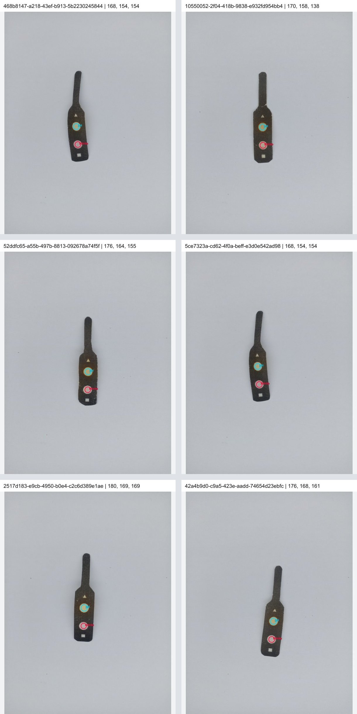

# SB-01 Nitrite repeatability audit — 2026-10-05

## Decision

**No production matcher change is justified by this evidence.** Replaying the six persisted production images from source commit `d686bbe0f476e2632ec94e752a822b05598cc64b` reproduces one accepted 0 ppm result and five rejections. The ROI overlays are valid, but the five distinct image byte sets do not form a tight single-color repeat cluster: Nitrite RGB spans R 168–180, G 154–169, B 138–169, and the most different rejected scan is 10.56 ΔE00 from the accepted scan. No Nitrite laboratory result exists for SB-01. Widening guards or normalizing away brightness would assign a chemistry class without enough calibration evidence and could erase separation among the client reference classes.

## Source and physical records

- Source SHA: `d686bbe0f476e2632ec94e752a822b05598cc64b` (worktree HEAD and `origin/main`).
- Six production DB rows are SB-01 / SB / Fish Farm, captured 2026-10-04 Manila time. Analysis IDs, timestamps, saved image paths and hashes are listed in [the six-scan evidence CSV](./NITRITE_SB01_REPEATABILITY_2026-10-05.csv).
- Photos for `468b8147-a218-43ef-b913-5b2230245844` and `5ce7323a-cd62-4f0a-beff-e3d0e542ad98` are byte-identical: 693,661 bytes, SHA-256 `BDA77CA26E8B5B017306946D898FEB87E4A726D71B8C92F9BE84C3E74B324B61`. The six records therefore contain five distinct photos.
- Each source frame is 3048×4064. The evidence CSV includes Nitrite ROI center, normalized center, pixel bounds, sample count, detection confidence, registration confidence and matcher diagnostics.

## ROI visual audit

All six overlays place the cyan circle inside the upper pH sensing zone and the red circle inside the lower Nitrite sensing zone. No pH/Nitrite role swap, rim/background sampling, or misplaced circle is visible. Registered-template confidence is 0.8312–0.8417; Nitrite detection confidence is 0.7794–0.8604. The lowest Nitrite detection confidence belongs to the one accepted scan, so low detection confidence does not explain the rejections.

## Persisted RGB and matcher decisions

The database stores the measured ROI RGB and result/status metadata, but not the full composite candidate-distance breakdown. I recomputed that breakdown from each stored RGB using the exact matcher and client calibration at the source SHA. “Score” is normalized composite distance; “margin” is runner-up score minus best score. ROI center and bounds are in the evidence CSV.

| Analysis ID | Manila time | Nitrite RGB | Lab L*,a*,b* | HSV H°,S,V | Best / runner-up | Score / margin | Decision |
|---|---|---:|---:|---:|---|---:|---|
| `468b8147-a218-43ef-b913-5b2230245844` | 21:55:15 | 168,154,154 | 64.78, 5.13, 1.86 | 0.0, 0.083, 0.659 | 0 / 1 | 1.502 / 0.259 | Reject: `OUTSIDE_COMPOSITE_ACCEPTANCE_THRESHOLD` |
| `10550052-2f04-418b-9838-e932fd954bb4` | 22:03:36 | 170,158,138 | 65.62, 0.99, 12.04 | 37.5, 0.188, 0.667 | 1 / 0 | 2.794 / 0.146 | Reject: `OUTSIDE_REFERENCE_COLOR_FAMILY` |
| `52ddfc65-a55b-497b-8813-092678a74f5f` | 22:04:07 | 176,164,155 | 68.13, 2.77, 6.23 | 25.7, 0.119, 0.690 | 1 / 0 | 1.683 / 0.055 | Reject: `OUTSIDE_COMPOSITE_ACCEPTANCE_THRESHOLD` |
| `5ce7323a-cd62-4f0a-beff-e3d0e542ad98` | 22:05:45 | 168,154,154 | 64.78, 5.13, 1.86 | 0.0, 0.083, 0.659 | 0 / 1 | 1.502 / 0.259 | Reject: `OUTSIDE_COMPOSITE_ACCEPTANCE_THRESHOLD` |
| `2517d183-e9cb-4950-b0e4-c2c6d389e1ae` | 22:06:14 | 180,169,169 | 70.14, 3.95, 1.42 | 0.0, 0.061, 0.706 | 0 / 1 | 0.761 / 0.438 | Accept: 0 ppm / Safe |
| `42a4b9d0-c9a5-423e-aadd-74654d23ebfc` | 22:06:46 | 176,168,161 | 69.33, 1.62, 4.64 | 28.0, 0.085, 0.690 | 0 / 1 | 1.417 / 0.171 | Reject: `AMBIGUOUS_RUNNER_UP_MARGIN` |

The accepted RGB `[180,169,169]` has ΔE00 4.022, RGB Euclidean distance 11.790 and normalized chromatic distance 0.01249 from the 0 ppm centroid. Its best/runner-up composite scores are 0.761 / 1.199, margin 0.438. The backend emits 0 ppm / Safe. The only accepted scan is below the generic Nitrite saturation-quality minimum (S=0.061), but the existing matcher accepts it because it meets the reference decision; this is existing policy, not a new change.

Rejected-to-accepted differences, listed as RGB Euclidean / ΔE00 / normalized-chromatic distance / circular hue difference:

- `468b8147...` and its byte-identical duplicate `5ce7323a...`: 24.37 / 4.49 / 0.00668 / 0.0°.
- `10550052...`: 34.38 / 10.56 / 0.03702 / 37.5°.
- `52ddfc65...`: 15.39 / 4.95 / 0.01621 / 25.7°.
- `42a4b9d0...`: 9.00 / 4.49 / 0.00988 / 28.0°.

The exact rejection counts among the five rejected records are three `OUTSIDE_COMPOSITE_ACCEPTANCE_THRESHOLD`, one `OUTSIDE_REFERENCE_COLOR_FAMILY`, and one `AMBIGUOUS_RUNNER_UP_MARGIN`. The `[168,154,154]` image scores 1.502 against the 1.500 limit but passes the 0.200 margin guard. `[176,164,155]` scores 1.683 and has only 0.055 margin. `[176,168,161]` is within the score limit but has 0.171 margin. `[170,158,138]` scores 2.794 and is outside the reference-family guard.

## Camera and reference-class separation

Four neutral corner background patches per frame pooled to these median RGB ranges across the six photos: R 186–187.5, G 190–190.5, B 193.5–194. The photographed background is nearly stable while the Nitrite ROI varies substantially, so a whole-frame exposure/white-balance shift is not evidenced. The cause of the color changes within the sensing pads remains unknown; these records alone cannot distinguish reagent/pad variation from local imaging effects.

Pairwise client-reference centroid separations were checked in all six pairs:

| References | ΔE00 | Lab a*b* distance | Normalized chromatic RGB |
|---|---:|---:|---:|
| 0 vs 0.5 | 4.271 | 4.813 | 0.010417 |
| 0 vs 1 | 5.883 | 5.647 | 0.020950 |
| 0 vs >1 | 4.999 | 4.966 | 0.009923 |
| 0.5 vs 1 | 7.428 | 8.669 | 0.024418 |
| 0.5 vs >1 | 1.927 | 0.218 | 0.000940 |
| 1 vs >1 | 7.098 | 8.885 | 0.024823 |

In particular, 0.5 vs >1 differs by only 0.218 in Lab a*b*, 0.000940 normalized-chromatic RGB, and 1.67° hue; their total ΔE00 separation is 1.927. A chroma-only or brightness-normalized RGB acceptance model would nearly collapse those client references. The six unlabelled photos do not provide class-labeled camera-domain samples from which to derive a safe alternate threshold.

## Ninety-photo set replay

Exactly the six client folders (90 image files) were reprocessed through the production analysis engine. A separate root-level contact-sheet image was excluded. Per-image results are in [the 90-photo CSV](./NITRITE_REAL_DATASET_RERUN_2026-10-05.csv).

- Usable Nitrite ROIs: 86/90; 4 registration/ROI failures.
- Accepted: 25; rejected among usable: 61; acceptance among usable ROIs: 29.1%.
- Accepted outputs: 0 ppm = 24; 0.5 ppm = 0; 1 ppm = 1; >1 ppm = 0.
- Rejections/failures: `OUTSIDE_COMPOSITE_ACCEPTANCE_THRESHOLD` = 33; `OUTSIDE_REFERENCE_COLOR_FAMILY` = 21; `AMBIGUOUS_RUNNER_UP_MARGIN` = 7; `NITRITE_ROI_INVALID` = 3; `PH_ROI_INVALID` = 1.
- No photo in this set has a known Nitrite laboratory concentration. These are matcher-behavior counts, not accuracy or clinical/environmental validation.

## Controls and regression QA

- Client reference controls: 0 ppm → Safe; 0.5 ppm → Warning; 1 ppm → Dangerous; >1 ppm → Dangerous with numeric value null and display `>1 ppm`. PASS.
- Negative controls: neutral `[160,160,160]`, dark `[20,20,20]`, bright `[255,255,255]`, 0/0.5 and 0/1 midpoint colors, and red out-of-family color all remain rejected. PASS.
- Full root `node --test`: 253 passed, 1 skipped (requires Node module mocks), 0 failed. This includes backend, services, real-image analysis, ROI registration, pH regression, persistence/serialization, Result/History/Map, auth/session and PDF/export tests.
- `npm ls --depth=0`: reports an existing missing `@maplibre/maplibre-react-native@^11.4.1` and extraneous `@types/geojson` and `react-native-maps` in this environment. No dependency installation was made.
- `npm --prefix backend ls --depth=0`: all declared backend dependencies resolve; this tree reports extraneous `@emnapi/runtime`, `@img/sharp-wasm32`, and `tslib`.
- `git diff --check` is run after writing this audit.

## Outcome

No calibration, matcher, ROI, UI, or backend code changed. No commit or Railway deployment was made; no APK rebuild was required. This audit does not resolve the physical repeatability complaint or establish Nitrite laboratory accuracy. A safe follow-up needs controlled repeated images of the same reacted pad under fixed camera/reference conditions and enough verified class references to preserve especially the 0.5 vs >1 distinction.
